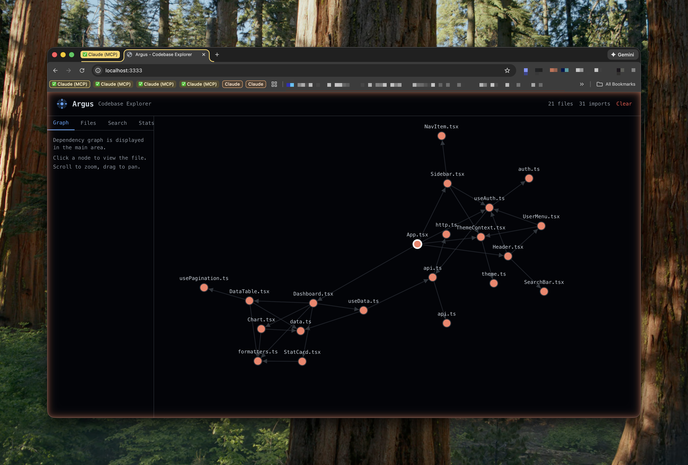

# Argus


**Codebase Intelligence Beyond Context Limits**

Argus is an AI-powered codebase analysis tool that understands your entire project, regardless of size. Using a hybrid approach of zero-cost structural queries and AI-powered reasoning, Argus provides intelligent answers about code architecture, patterns, and relationships that would be impossible with traditional context-limited approaches.

## Key Features

| Feature | Description |
|---------|-------------|
| **Zero-Cost Dependency Queries** | Find importers, symbols, and file dependencies instantly with pre-computed metadata |
| **Progressive Disclosure Search** | 3-tier search architecture: `find_files` -> `search_codebase` -> `get_context` |
| **Enhanced Snapshots** | Import graphs, export indexes, and symbol lookups built into every snapshot |
| **Worker Service** | Persistent LRU caching for repeated queries (port 37778) |
| **Web UI** | Interactive D3.js dependency graph visualization |
| **Multi-Provider AI** | ZAI, Anthropic, OpenAI, DeepSeek, and Ollama support |
| **Claude Code Integration** | Native MCP server with global instructions for all agents |

## Quick Start

```bash
# 1. Install globally via npm
npm install -g @sashabogi/argus-mcp

# 2. Interactive setup (configures API keys and preferences)
argus init

# 3. Add to Claude Code (installs MCP + global instructions)
argus mcp install

# 4. Set up any project
argus setup .
```

That's it! Argus is now integrated into Claude Code and will automatically be used for codebase exploration.

## Installation

### npm (Recommended)

```bash
npm install -g @sashabogi/argus-mcp
```

### Manual Installation

```bash
git clone https://github.com/sashabogi/argus.git
cd argus
npm install
npm run build
npm link
```

### Update

```bash
argus update
```

---

## Features

### 1. Progressive Disclosure MCP Tools

Argus provides 6 MCP tools with a tiered cost structure, optimized for token efficiency:

| Tool | Cost | Use Case |
|------|------|----------|
| `search_codebase` | **FREE** | Fast regex search across the entire snapshot |
| `find_files` | **FREE** | Glob pattern matching for file discovery |
| `get_context` | **FREE** | Extract N lines around a specific location |
| `find_importers` | **FREE** | Find all files that import a given module |
| `find_symbol` | **FREE** | Locate where a symbol is exported from |
| `get_file_deps` | **FREE** | Get all imports of a specific file |
| `analyze_codebase` | ~500 tokens | AI-powered deep analysis for complex questions |
| `semantic_search` | ~100 tokens | Natural language code search using FTS5 |
| `create_snapshot` | ~100 tokens | Create or refresh a codebase snapshot |

**Workflow Example:**

```bash
# Step 1: Find files (FREE)
find_files(".argus/snapshot.txt", "**/*auth*")

# Step 2: Search for patterns (FREE)
search_codebase(".argus/snapshot.txt", "handleAuth")

# Step 3: Get context around a match (FREE)
get_context(".argus/snapshot.txt", "src/auth.ts", 42, 10, 20)

# Step 4: Only if needed - AI analysis (~500 tokens)
analyze_codebase(".argus/snapshot.txt", "How does the authentication flow work?")
```

### 2. Enhanced Snapshots

Every snapshot includes structural metadata that enables zero-cost dependency queries:

```bash
# Create an enhanced snapshot (default)
argus snapshot . -o .argus/snapshot.txt

# Create a basic snapshot (faster, smaller, no metadata)
argus snapshot . -o .argus/snapshot.txt --basic
```

**Metadata Included:**

- **Import Graph** - Which files import which other files
- **Export Index** - Symbol -> files that export it
- **Who Imports Whom** - Reverse dependency graph for impact analysis
- **Function Signatures** - With line numbers for precise navigation

**Example Zero-Cost Queries:**

```typescript
// Find where useAuth is exported from
find_symbol(".argus/snapshot.txt", "useAuth")
// -> { file: "contexts/auth-context.tsx", line: 42 }

// Find all files that depend on auth-context
find_importers(".argus/snapshot.txt", "auth-context")
// -> ["app.tsx", "dashboard.tsx", "settings.tsx"]

// Get dependencies of a specific file
get_file_deps(".argus/snapshot.txt", "src/app.tsx")
// -> ["./auth", "./theme", "@/components/ui"]
```

### 3. Worker Service

For optimal performance, Argus includes a persistent worker service that caches parsed snapshots in memory:

```bash
# Start the worker service
argus worker start

# Check worker status
argus worker status

# Stop the worker
argus worker stop
```

**Worker Features:**

- **LRU Cache** - Keeps up to 5 parsed snapshots in memory
- **File Watching** - Detects changes and invalidates cache automatically
- **REST API** - Available on port 37778

**API Endpoints:**

| Endpoint | Method | Description |
|----------|--------|-------------|
| `/health` | GET | Health check and cache stats |
| `/snapshot/load` | POST | Load a snapshot into cache |
| `/search` | POST | Search using cached snapshot |
| `/context` | POST | Get context from cached snapshot |
| `/watch` | POST | Start watching a project |
| `/watch` | DELETE | Stop watching a project |

### 4. Web UI - Codebase Explorer

Argus includes a visual codebase explorer for understanding your project structure:

```bash
# Open the web UI
argus ui

# Specify a custom port
argus ui --port 4000
```



**Web UI Features:**

- **Dependency Graph** - D3.js force-directed visualization of file relationships
- **File Tree Explorer** - Navigate your codebase with line counts
- **Full-Text Search** - Search across all files with highlighting
- **Code Viewer** - View file contents with syntax highlighting
- **Stats Dashboard** - Overview of files, imports, and exports

### 5. Claude Lifecycle Hooks

Argus can automatically update snapshots using Claude Code's lifecycle hooks:

**Session Start Hook:**
- Checks for `.argus/snapshot.txt` on session start
- Warns if snapshot is stale (>1 hour old)

**Post-Tool Hook:**
- Fires after Write/Edit operations
- Notifies worker service of file changes for cache invalidation

---

## CLI Commands

| Command | Description |
|---------|-------------|
| `argus init` | Interactive setup wizard for API keys and preferences |
| `argus setup [path]` | One-command project setup (snapshot + CLAUDE.md + .gitignore) |
| `argus snapshot <path>` | Create a codebase snapshot |
| `argus analyze <path> <query>` | Analyze codebase with AI |
| `argus query <snapshot> <query>` | Query an existing snapshot |
| `argus search <snapshot> <pattern>` | Fast grep search (no AI) |
| `argus status [path]` | Check if snapshot is up to date |
| `argus mcp install` | Install MCP server for Claude Code |
| `argus mcp uninstall` | Remove from Claude Code |
| `argus context generate <path>` | Generate architecture summary |
| `argus context inject <path>` | Add architecture section to CLAUDE.md |
| `argus config [key] [value]` | View or modify configuration |
| `argus ui` | Open the web UI for visualization |
| `argus update` | Update Argus to the latest version |

### Command Options

**`argus snapshot`**
```bash
argus snapshot ./my-project -o .argus/snapshot.txt
  --extensions, -e    File extensions to include (comma-separated)
  --exclude           Patterns to exclude (comma-separated)
  --output, -o        Output file path
  --basic             Skip structural metadata (faster, smaller)
```

**`argus analyze`**
```bash
argus analyze ./my-project "What are the main modules?"
  --provider, -p      Override default provider
  --max-turns, -t     Maximum reasoning turns (default: 15)
  --verbose, -v       Show detailed execution logs
```

**`argus search`**
```bash
argus search .argus/snapshot.txt "authentication"
  --ignore-case, -i   Case-insensitive search
  --max-results, -n   Maximum results (default: 50)
```

**`argus ui`**
```bash
argus ui
  --port, -p          Port to serve on (default: 3333)
  --no-open           Do not open browser automatically
```

---

## MCP Server Setup

### Automatic Installation

```bash
argus mcp install
```

This command:
1. Creates a wrapper script at `~/.argus/argus-mcp-wrapper`
2. Registers the MCP server with Claude Code
3. Injects Argus instructions into `~/.claude/CLAUDE.md` (global for all projects)

### Manual Installation

If automatic installation fails, add manually:

```bash
claude mcp add argus -s user -- ~/.argus/argus-mcp-wrapper
```

### MCP Tool Reference

Once installed, Claude Code has access to these tools:

**`search_codebase`** - Zero-cost regex search
```typescript
search_codebase({
  path: ".argus/snapshot.txt",
  pattern: "handleAuth",
  caseInsensitive: true,   // default: true
  maxResults: 50,          // default: 50, max: 200
  offset: 0,               // for pagination
  contextChars: 80         // truncate context
})
```

**`find_files`** - Zero-cost glob matching
```typescript
find_files({
  path: ".argus/snapshot.txt",
  pattern: "**/*.test.ts",
  caseInsensitive: true,   // default: true
  limit: 100               // default: 100, max: 500
})
```

**`get_context`** - Zero-cost context extraction
```typescript
get_context({
  path: ".argus/snapshot.txt",
  file: "src/auth.ts",
  line: 42,
  before: 10,              // lines before
  after: 20                // lines after
})
```

**`find_importers`** - Zero-cost dependency query
```typescript
find_importers({
  path: ".argus/snapshot.txt",
  target: "src/auth.ts"
})
```

**`find_symbol`** - Zero-cost symbol lookup
```typescript
find_symbol({
  path: ".argus/snapshot.txt",
  symbol: "useAuth"
})
```

**`get_file_deps`** - Zero-cost import list
```typescript
get_file_deps({
  path: ".argus/snapshot.txt",
  file: "src/app.tsx"
})
```

**`analyze_codebase`** - AI-powered analysis (~500 tokens)
```typescript
analyze_codebase({
  path: ".argus/snapshot.txt",
  query: "How does authentication work?",
  maxTurns: 15             // default: 15
})
```

**`semantic_search`** - Natural language search
```typescript
semantic_search({
  path: "/path/to/project",
  query: "authentication middleware",
  limit: 20                // default: 20
})
```

---

## Configuration

Argus stores configuration in `~/.argus/config.json`. Run `argus init` for interactive setup.

```json
{
  "provider": "anthropic",
  "providers": {
    "anthropic": {
      "apiKey": "sk-ant-...",
      "model": "claude-sonnet-4-20250514"
    },
    "zai": {
      "apiKey": "your-api-key",
      "model": "glm-4.7",
      "endpoint": "https://api.z.ai/api/coding/paas/v4"
    },
    "openai": {
      "apiKey": "sk-...",
      "model": "gpt-4o"
    },
    "deepseek": {
      "apiKey": "your-api-key",
      "model": "deepseek-chat"
    },
    "ollama": {
      "baseUrl": "http://localhost:11434",
      "model": "qwen2.5-coder:7b"
    }
  },
  "defaults": {
    "maxTurns": 15,
    "turnTimeoutMs": 60000,
    "snapshotExtensions": ["ts", "tsx", "js", "jsx", "rs", "py", "go", "java"],
    "excludePatterns": ["node_modules", ".git", "dist", "build"]
  }
}
```

### Supported Providers

| Provider | Models | Best For |
|----------|--------|----------|
| **ZAI** | GLM-4.7, GLM-4.6 | Best value, excellent coding |
| **Anthropic** | Claude Sonnet/Opus | Highest quality reasoning |
| **OpenAI** | GPT-4o, GPT-4 | General purpose |
| **DeepSeek** | DeepSeek Chat/Coder | Budget-friendly |
| **Ollama** | Qwen, CodeLlama, etc. | Free, local, private |

---

## API Reference

### Worker Service (Port 37778)

**Health Check**
```bash
curl http://localhost:37778/health
```
Response:
```json
{
  "status": "ok",
  "version": "2.0.0",
  "cached": 2,
  "watching": 1
}
```

**Load Snapshot**
```bash
curl -X POST http://localhost:37778/snapshot/load \
  -H "Content-Type: application/json" \
  -d '{"path": "/path/to/.argus/snapshot.txt"}'
```

**Search**
```bash
curl -X POST http://localhost:37778/search \
  -H "Content-Type: application/json" \
  -d '{
    "path": "/path/to/.argus/snapshot.txt",
    "pattern": "handleAuth",
    "options": {"caseInsensitive": true, "maxResults": 50}
  }'
```

**Get Context**
```bash
curl -X POST http://localhost:37778/context \
  -H "Content-Type: application/json" \
  -d '{
    "path": "/path/to/.argus/snapshot.txt",
    "file": "src/auth.ts",
    "line": 42,
    "before": 10,
    "after": 20
  }'
```

---

## How It Works

Argus uses a **Recursive Language Model (RLM)** approach:

1. **Snapshot Creation** - Your codebase is compiled into an optimized text snapshot with structural metadata
2. **Query Analysis** - The LLM receives your question and the Nucleus DSL reference
3. **Iterative Exploration** - The LLM generates symbolic commands (grep, filter, map, etc.)
4. **Command Execution** - Commands run against the full snapshot in a sandbox
5. **Reasoning Loop** - Results feed back to the LLM for further analysis
6. **Final Answer** - Once sufficient information is gathered, a comprehensive answer is provided

This allows analysis of codebases **far exceeding** typical context limits (2M+ characters) while using minimal tokens per query.

### Nucleus DSL Reference

Argus uses the [Nucleus DSL](https://github.com/michaelwhitford/nucleus) for document operations:

```lisp
; Search
(grep "pattern")                    ; Find matching lines
(grep "error" "i")                  ; Case-insensitive search

; Transform
(map RESULTS (lambda (x) ...))      ; Transform results
(filter RESULTS (lambda (x) ...))   ; Filter results
(sort RESULTS key)                  ; Sort results

; Aggregate
(count RESULTS)                     ; Count items
(sum RESULTS)                       ; Sum numeric values
(first RESULTS)                     ; Get first item
(take RESULTS n)                    ; Get first n items

; Extract
(match str "pattern" group)         ; Regex extraction
(split str delimiter)               ; Split string

; Final Answer
<<<FINAL>>>your answer here<<<END>>>
```

---

## Requirements

- Node.js 18+
- npm or pnpm
- API key for your chosen provider (or Ollama for free local usage)

---

## FAQ & Documentation

- **[FAQ](./docs/FAQ.md)** - Common questions about costs, workflow, and troubleshooting
- **[CLAUDE.md Integration](./docs/CLAUDE_MD_INTEGRATION.md)** - How to add Argus to your project's CLAUDE.md

### Quick Answers

**"Do I need to pay for another API?"**
No! Use Ollama (free, local) or zero-cost tools like `search_codebase` (no AI at all).

**"I'm starting a fresh project - how does Argus help?"**
Argus works from Day 0. Snapshot your PRD/TDD, then refresh as you build. See [FAQ](./docs/FAQ.md#im-starting-a-brand-new-project---theres-nothing-to-scan-yet).

**"How do I keep the snapshot updated?"**
Run `argus status .` to check freshness, then `argus snapshot .` to refresh. See [FAQ](./docs/FAQ.md#how-do-i-keep-the-snapshot-up-to-date).

**"What's the difference between basic and enhanced snapshots?"**
Enhanced snapshots (default) include import graphs and export indexes that enable zero-cost dependency queries. Basic snapshots are faster to create but only support regex search.

---

## Acknowledgments

Argus builds upon and extends the innovative work of [Matryoshka RLM](https://github.com/yogthos/Matryoshka) by [Dmitri Sotnikov (yogthos)](https://github.com/yogthos).

The Matryoshka project introduced the brilliant concept of **Recursive Language Models (RLM)** - using an LLM to generate symbolic commands (via the [Nucleus DSL](https://github.com/michaelwhitford/nucleus)) that are executed against documents, enabling analysis of files far exceeding context window limits. This approach achieves **93% token savings** compared to traditional methods.

**What Argus adds:**

| Matryoshka | Argus |
|------------|-------|
| Single file analysis | Full codebase analysis |
| CLI-only | CLI + MCP Server + Web UI |
| Ollama/DeepSeek providers | Multi-provider (ZAI, Anthropic, OpenAI, Ollama, DeepSeek) |
| Manual configuration | Interactive setup wizard |
| Document-focused | Code-aware with structural metadata |
| No caching | Worker service with LRU cache |

We encourage you to explore the original [Matryoshka](https://github.com/yogthos/Matryoshka) project and the [RLM research paper](https://arxiv.org/abs/2512.24601) that inspired this approach.

### claude-mem

The Argus 2.0 upgrade was heavily inspired by [claude-mem](https://github.com/thedotmack/claude-mem) by [thedotmack](https://github.com/thedotmack). The progressive disclosure architecture, self-documenting MCP tools, and Claude Code integration patterns were adapted from claude-mem's innovative approach to context management.

---

## License

MIT License - See [LICENSE](./LICENSE)

## Contributing

Contributions are welcome! Please read our contributing guidelines before submitting PRs.

## Related Projects

- [Matryoshka RLM](https://github.com/yogthos/Matryoshka) - The original RLM implementation that inspired Argus
- [claude-mem](https://github.com/thedotmack/claude-mem) - Progressive disclosure and MCP patterns that inspired Argus 2.0
- [Nucleus DSL](https://github.com/michaelwhitford/nucleus) - The symbolic language used for document operations
- [RLM Paper](https://arxiv.org/abs/2512.24601) - Academic research on Recursive Language Models
